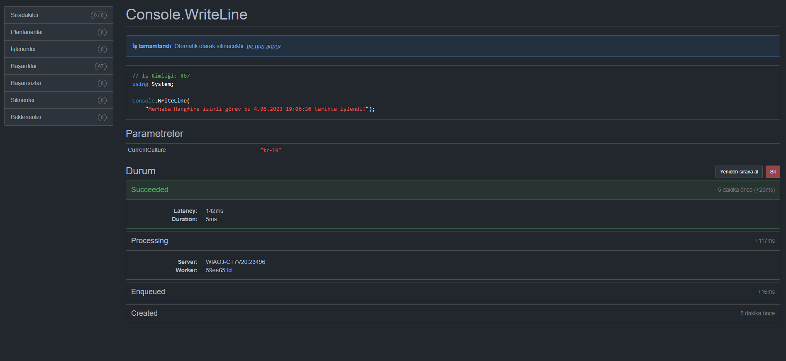

# Hangfire ve Background Service

## Hangfire

Hangfire, .NET uygulamalarında arka plan işlemleri çalıştırmak için kullanılan bir kütüphanedir.
Bu kütüphane arka plan işlerini yönetmek için kullanılan güçlü bir araçtır ve uygulamalarda arka planda gerçekleşecek işlemler için sıklıkla kullanılır. Uygulamanın genel performansını ve kullanıcı deneyimini önemli ölçüde artırabilir. Depolama alanı olarak birçok veritabanı (SQL Server, SQL Server + MSMQ, Redis ve daha fazlası), IoC Container ve UnitTest desteklemektedir.

Hangfire kurulumu, konfigürasyonu, kullanımı oldukça basittir. Bir güzel tarafı ise dashboard yardımıyla izlenebilir ve müdahale edilebilir yani dashboard üzerinden tetiklenebilir olmasıdır.


### Özellikleri

- Uzun süren ve yoğun işlemleri gerçekleştirmek için kullanılır.

- İşlemlerin durumunu izlemek için bir dahili gösterge tablosu sağlar.

- İşleri zamanlamak, geciktirmek veya tekrar tekrar çalıştırmak için kullanılabilir.

- İşlemleri yönetmek ve izlemek için kendi dahili gösterge tablosunu kullanır.

- İşler veritabanında tutulduğu için güvenilirdir. İş tamamlanmadıkça tamamlandı durumuna geçmez, kod bloğunun bitimine kadar çıkacak herhangi bir sorunda iş tekrar çalışacaktır.(Background jobların yarım kalması ve tekrarlanmaması)

## Background Service

Background service, .NET Core ile gelen bir özelliktir.

### Özellikleri

- Belirli bir süre boyunca veya belirli bir koşul gerçekleşene kadar sürekli olarak çalışan bir arka plan işlemi oluşturur.
- Durumları izlemek, veritabanı işlemleri gerçekleştirmek veya dış API'leri çağırmak için kullanılır.
- Bir işin durumunu izlemek veya planlamak için dahili bir araç sağlamaz.

## Hangfire ve Background Service Arasındaki Farklar

- Hangfire, işlemleri zamanlamak, geciktirmek ve tekrar çalıştırmak gibi özelliklere sahip olmasıdır.
- Hangfire, işlemlerin durumunu izlemek için bir dahili gösterge tablosu sağlar.
- Background service, belirli bir süre boyunca veya belirli bir koşul gerçekleşene kadar sürekli olarak çalışan bir arka plan işlemi oluşturur.
- Background service, Hangfire'ın sunduğu gibi işlemleri zamanlamak veya durumlarını izlemek için dahili bir araç sağlamaz.

Hangfire ve background service arasında hangisini kullanacağınız, uygulamanızın gereksinimlerine ve belirli durumunuza bağlıdır. Hangfire, işlemlerin zamanlaması ve izlenmesi gerektiğinde daha uygun olabilir, oysa background service, sürekli çalışan bir işlem gerektiğinde daha uygun olabilir.

## Hangfire'ın Avantajları

- **Arka Plan Görevleri**: Hangfire, bir HTTP isteği bağlamında veya ayrı bir servis içinde çalışacak şekilde arka plan işlemlerini planlamanıza olanak sağlar.
- **Zamanlanmış Görevler**: Hangfire ile, belirli bir süre sonra veya belirli bir zaman diliminde çalıştırılacak görevleri kolayca zamanlayabilirsiniz.
- **Tekrarlayan İşlemler**: Hangfire, belirli bir zaman diliminde tekrar eden işlemleri kolayca yönetmenizi sağlar. Bu, belirli bir süre boyunca düzenli olarak çalıştırılması gereken görevler için çok kullanışlıdır.
- **Görev İzleme**: Hangfire, arka plan görevlerinin durumunu izlemenizi ve hataları belirlemek için günlükleri görüntülemenizi sağlar.
- **Otomatik Yeniden Deneme**: Hangfire, başarısız olan görevleri otomatik olarak yeniden deneyebilir. Bu, ağ hataları veya diğer geçici sorunlar nedeniyle başarısız olan görevlerin düzgün bir şekilde tamamlanmasını sağlar.
- **Kolay Entegrasyon**: Hangfire, çeşitli veritabanı sistemleri ve .NET projeleri ile kolayca entegre edilebilir.

Bu dökümanda hangfire uygulaması yapacağız.

# Hangfire Uygulaması

Hangfire, .NET uygulamalarında arka plan işlemleri çalıştırmak için kullanılan bir kütüphanedir. İşlemleri yönetmek ve izlemek için kendi dahili gösterge tablosunu kullanır.

# Hangfire'da Bulunan Görev (Job) Tipleri

- Ücretsiz Görev Tipleri
    - **FireAndForget:** Bir kere ve hemen çalışan görev tipidir. İş tanımlanır ve ardından bir kere tetiklenir.
    ```csharp
        BackgroundJob.Enqueue
    ```
    - **Delayed:** Oluşturulduktan __belli bir zaman__ sonra sadece bir kere çalışan görev tipidir.
    ```csharp
        BackgroundJob.Schedule
    ```
    - **Recurring:** Çok kez ve belirtilmiş __CRON__ süresince (günlük, haftalık, saatlik veyan CRON Expression) çalışan görev tipidir.
    ```csharp
        BackgroundJob.AddOrUpdate
    ```
    - **Continuations:** Birbiriyle ilişkili işlerin olduğu zaman çalışan görev tipidir. Bir görevin tetiklenmesi için bir başka görevin tamamlanması gerekiyor.
    ```csharp
        BackgroundJob.ContinueWith
    ```
- Ücretli Görev Tipleri
    - **Batch:** Birden fazla işin grup halinde çalıştığı görev tipidir.
    ```csharp
        BackgroundJob.StartNew
    ```
    - **Batch Continuations:** Grup halinde çalışan ana görev işleminin bitmesiyle çalışan görev tipidir.
    ```csharp
        BackgroundJob.ContinueWith
    ```


## Hangfire'ın Kurulumu

İlk olarak, Hangfire'ı projenize eklemelisiniz. Bu, NuGet Package Manager kullanılarak yapılır.

```csharp
dotnet add package Hangfire.Core
dotnet add package Hangfire.AspNetCore
dotnet add package Hangfire.SqlServer
dotnet add package Microsoft.Data.SqlClient
```

### Veritabanı Oluşturma
Hangfire oluşturulan görevleri veritabanında tutmaktadır, ve görevler tamamlandıkça silmektedir.
Veritabanını otomatik oluşturmasada gerekli tabloları kendisi oluşturmaktadır.

appsettings.json dosyasını bu şekilde yapılandırıyoruz.
```json
{
    "Logging": {
        "LogLevel": {
            "Default": "Information",
            "Microsoft.AspNetCore": "Warning",
            "Hangfire": "Information"
        }
    },
    "AllowedHosts": "*",
    "ConnectionStrings": {
        "HangfireConnectionString": ""
    }
}
```

## Hangfire'ın Başlatılması
Daha sonra, projenizde Hangfire'ı kullanacağını söylemeniz gerekir. Bu, genellikle Program.cs dosyasında yapılır. (.Net 5 ve altı sürümlerde Startup.cs)

Uygulamamız .Net 7 kullanacağı için konfigürasyonunu bu şekilde yapıyoruz.
```csharp
var builder = WebApplication.CreateBuilder(args);

string hangfireDatabaseConnectionString = builder.Configuration.GetConnectionString("HangfireConnectionString");

builder.Services.AddHangfire(configuration => {
    configuration.SetDataCompatibilityLevel(CompatibilityLevel.Version_180)
                 .UseSimpleAssemblyNameTypeSerializer()
                 .UseRecommendedSerializerSettings()
                 .UseSqlServerStorage(hangfireDatabaseConnectionString);
});
builder.Services.AddHangfireServer();

var app = builder.Build();

app.UseHangfireDashboard(); // Varsayılan hangfire paneli

app.UseHangfireDashboard("/myHangfireDashboard", new() {
        DashboardTitle = "Wiaoj Custom Hangfire Dashboard",
}); // Bu şekilde özelleştirilebilir

// "/myHangfireDashboard" -> bu kısım panele ulaşacağımız url olmaktadır

app.Run();
```

### .Net 5 ve Altı Sürümler

```csharp
private IEnumerable<IDisposable> GetHangfireServers() {
    GlobalConfiguration.Configuration
        .SetDataCompatibilityLevel(CompatibilityLevel.Version_170)
        .UseSimpleAssemblyNameTypeSerializer()
        .UseRecommendedSerializerSettings()
        .UseSqlServerStorage("Hangfire Connection String");

    yield return new BackgroundJobServer();
    }

public void Configuration(IAppBuilder app) {
        app.UseHangfireAspNet(GetHangfireServers);
        app.UseHangfireDashboard();

        BackgroundJob.Enqueue(() => Debug.WriteLine("Hello world from Hangfire!"));
    }
```

## Yetkilendirme
Hangfire üzerinden panel'e erişebilecek üyeleri yetkilendirebiliriz.
Öncelikle bu şekilde bir filter tanımlıyoruz. (Buradaki RoleEnum isimli enum uygulama içerisinde kullanacağımız değerleri tutmaktadır.)

[](authorization-filter)
```csharp
app.UseEndpoints(endpoints => {
    endpoints.MapHangfireDashboard("/myHangfireDashboard", new() {
        DashboardTitle = "Wiaoj Custom Hangfire Dashboard",
        Authorization = new[] {
            new HangfireDashboardAuthorizationFilter() // -> bu kısma ekliyoruz
        }
    });
    ;
});
```

## Görevin Oluşturulması
Ardından, bir iş oluşturabilir ve Hangfire'a bu işi arka planda çalıştırmasını söyleyebilirsiniz.

```csharp
BackgroundJob.Enqueue(() => SendInvoiceEmail(orderId));
```

Bu kod parçası, SendInvoiceEmail adında bir fonksiyonu arka planda çalıştırır. Bu fonksiyon, bir siparişin detaylarını alır, bir fatura oluşturur ve müşteriye bir e-posta gönderir.

## Görevlerin Takibi
Hangfire'ın dahili gösterge tablosunu kullanarak, işin durumunu izleyebiliriz. Bu, Hangfire'ın sağladığı bir web arayüzüdür ve genellikle **http://applicationurl:port/hangfire** adresinde bulunur. Burada, Hangfire'ın hangi işleri çalıştırdığını, hangi işlerin hala beklediğini, hangi işlerin tamamlandığını ve hangi işlerin başarısız olduğunu görebiliriz.

# Görev Oluşturma
[](create-job)

bu şekilde basit bir görev oluşturarak neler olduğunu inceleyelim.


Konsol üzerinde bu şekilde bir çıktı veriyor.
[](create-job-console)

Dashboard üzerinden ise bu şekilde inceleyebiliyoruz.
[](create-job-console)


## Yararlanılan kaynaklar
- https://docs.hangfire.io/en/latest/index.html
- https://chat.openai.com/
- https://medium.com/devopsturkiye/asp-net-core-hangfire-ile-arka-plan-i%CC%87%C5%9Flemleri-986790c37cf3
    