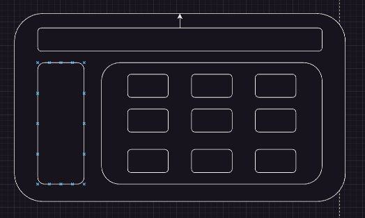
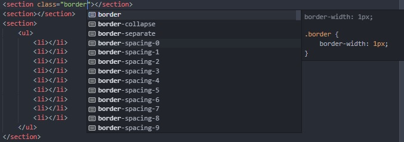
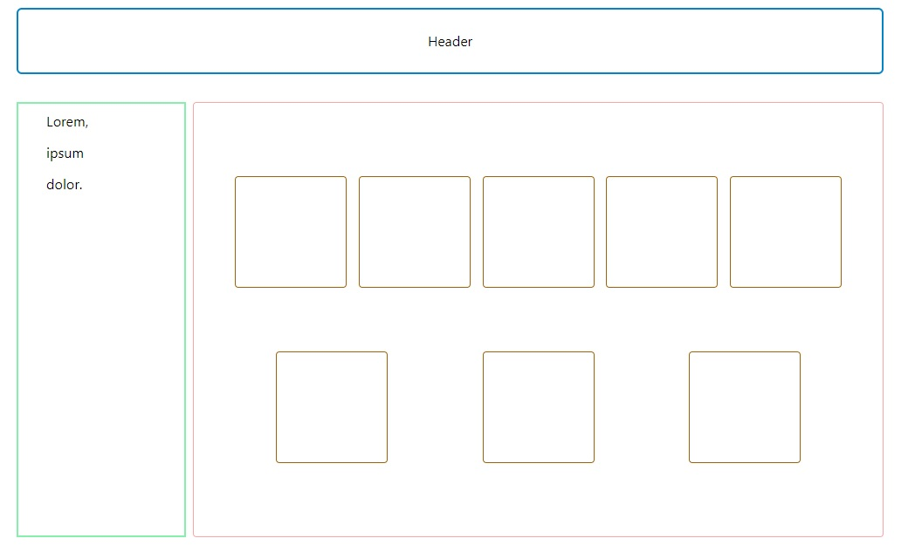

# Tailwind Css

## Nasıl kurulur?

|Projeme nasıl eklerim?|
|-|

```bash
npm install -D tailwindcss 
```

|Konfigürasyon dosyasını nasıl oluşturabilirim?|
|-|
```bash
npx tailwindcss init
```

|Oluşturulan konfigürasyon dosyası|
|-|
```javascript
/** @type {import('tailwindcss').Config} */
module.exports = {
  content: [],
  theme: {
    extend: {},
  },
  plugins: [],
}
```

Bu kısımda content içerisine hangi html veya javascript dosyalarını içereceğini söylüyoruz.

```javascript
/** @type {import('tailwindcss').Config} */
module.exports = {
//   content: ["./src/**/*.{html,js}"],
  content: ["./**/*{html,js}"],
  theme: {
    extend: {},
  },
  plugins: [],
}
```

|Kurulum tamamlandı, ne yapmalıyım?|
|-|
Ana css dosyası içerisine tailwind'in base direktifi yazılır
```css
@tailwind base;
@tailwind components;
@tailwind utilities;
```

|Bunları yaptım ama css çalışmıyor diyorsanız 🤔|
|-|
|Tailwind css ilgili değişiklikleri inceleyip belirtilen klasöre .css olarak çıktı verir.|
|-i css dosyalarının klasörü, -o ise çıktı verilecek klasör, --watch değişiklikleri takip et demektir.|
```bash
npx tailwindcss -i ./styles/style.css -o ./dist/style.css --watch
```

|Html içerisine nasıl dahil ederim derseniz de|
|-|
|Burada dikkat edilmesi gereken kısım, link içerisindeki href="" içerisindeki değerin|
|bizim -o parametresi içerisinde verdiğimiz değeri içermesi.|
```html
<head>
    <meta charset="UTF-8">
    <meta http-equiv="X-UA-Compatible" content="IE=edge">
    <meta name="viewport" content="width=device-width, initial-scale=1.0">
    <title>Document</title>
    <link rel="stylesheet" href="~/dist/style.css"> <!----->
</head>
```

[Detaylı bilgi için tıklayın](https://tailwindcss.com/docs/installation)
[Components](https://tailwindui.com/components?ref=sidebar)

Bu projede altta gördüğünüz layout'u tasarlayacağız


[Tasarlamadan önce Visual Studio Code'a Tailwind Css extension'unu indirmenizi tavsiye ederim. (Extension'u gör)](https://marketplace.visualstudio.com/items?itemName=bradlc.vscode-tailwindcss)


Tailwind hakkında biraz bilgi vermek gerekirse
- Tamamen inline css olarak geçer.
- Html dosyasından ayrılmadan yani herhangi bir css dosyasına yazmadan, ilgili classlar kullanılır.
- Kendi class'larını yazarak onları da kullanabilirsiniz.
- Üçüncü parti kütüphaneler ile beraber de kullanılabilir.
```css
@tailwind base;
@tailwind components;

.select2-dropdown {
  @apply rounded-b-lg shadow-md;
}
.select2-search {
  @apply border border-gray-300 rounded;
}
.select2-results__group {
  @apply text-lg font-bold text-gray-900;
}
/* ... */

@tailwind utilities;
```




|Eğer istersek class içerisinde kendi değerlerimizi kullanabiliriz|
|-|
|Buradaki w-4/5 değeri %80'dir, Yani w-[80%] yaparak da kullanabiliriz|
|...-[ ] aralığında kendi değerlerimizi verebiliriz.|
```html
<header class="w-4/5 border-2 border-cyan-200 rounded-md">
        Header
</header>
```

|Hover gibi özelliklerin kullanımı|
|-|
|[Detaylı bilgi için tıklayın](https://tailwindcss.com/docs/hover-focus-and-other-states)|
```html
<button class="bg-sky-500 hover:bg-sky-700 ...">
  Save changes
</button>
```

|Layout'un tamamlanmış hali|
|-|

```html
<body class="w-[80%] h-screen p-7 flex flex-col m-auto gap-8">
    <header class="w-full border-2 border-sky-600 rounded-md text-center p-6">
        Header
    </header>
    <main class="flex gap-2 h-full">
        <section class="border-2 border-green-300 w-3/12 h-3/5">
            <ul class="flex flex-col gap-3 py-2 ms-8">
                <li>Lorem,</li>
                <li>ipsum</li>
                <li>dolor.</li>
            </ul>
        </section>
        <section class="w-full h-3/5 flex flex-row gap-6 p-10 border rounded border-red-300">
            <ul class="flex flex-row flex-wrap content-around justify-around border-1 rounded border-yellow-400 p-2 px-0">
                <li class="border rounded border-yellow-700 w-[8rem] h-[8rem]"></li>
                <li class="border rounded border-yellow-700 w-[8rem] h-[8rem]"></li>
                <li class="border rounded border-yellow-700 w-[8rem] h-[8rem]"></li>
                <li class="border rounded border-yellow-700 w-[8rem] h-[8rem]"></li>
                <li class="border rounded border-yellow-700 w-[8rem] h-[8rem]"></li>
                <li class="border rounded border-yellow-700 w-[8rem] h-[8rem]"></li>
                <li class="border rounded border-yellow-700 w-[8rem] h-[8rem]"></li>
                <li class="border rounded border-yellow-700 w-[8rem] h-[8rem]"></li>
            </ul>
        </section>
    </main>
</body>
```


